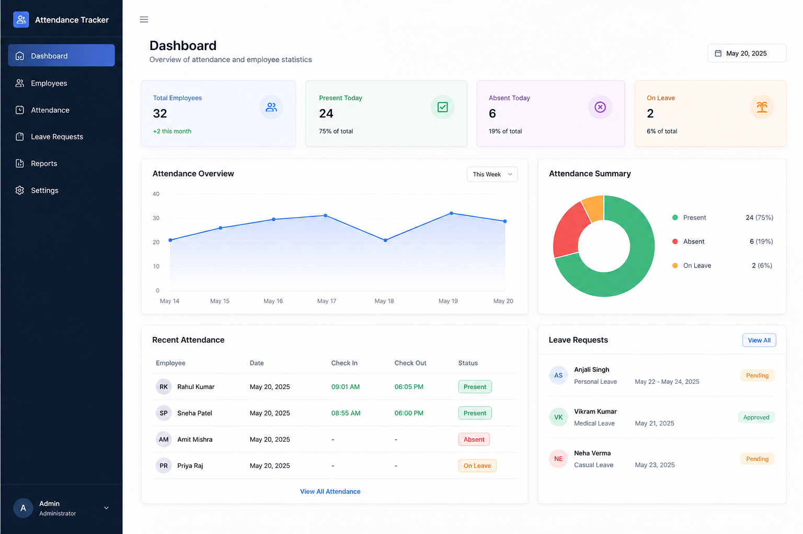
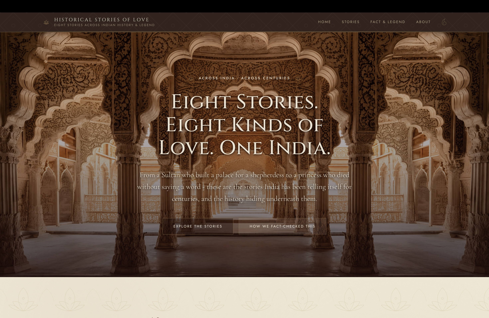
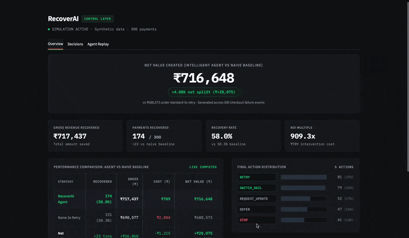

# ANANYA BINJOLA

  

  <b>Design Technologist & Full-Stack / Mobile Engineer</b> 
  Bridging precision visual architecture, offline-first apps, and AI decision systems.

  
  &nbsp;
  
  &nbsp;
  
  &nbsp;
  

---

### ✦ SELECTED BUILDS

<table>
  <tr>
    <td width="35%" align="center" valign="middle">
      
    </td>
    <td width="65%" valign="middle">
      <h3>🐾 PetVerse — Pet Social & Safety Ecosystem</h3>
      
A connected mobile ecosystem featuring pet identity passports, lost-pet safety radar, and geo-targeted playdate scheduling.

      

        • Designed <b>30+ modular screens</b> with interaction flows in Figma. 
        • Engineered a <b>17-table Supabase backend</b> with real-time state sync.
      

      

        
      

      

        
        &nbsp;
        
      

    </td>
  </tr>

  <tr>
    <td width="35%" align="center" valign="middle">
      
    </td>
    <td width="65%" valign="middle">
      <h3>📱 Workplace Attendance Tracker</h3>
      
Cross-platform solo mobile client built for workforce check-ins, credential authentication, and offline timecard management.

      

        • Designed an <b>offline-first architecture</b> using SQLite for robust local synchronization. 
        • Implemented daily work-hour calculation algorithms and custom mobile UI flows in Figma.
      

      

        
      

      

        
      

    </td>
  </tr>

  <tr>
    <td width="35%" align="center" valign="middle">
      
    </td>
    <td width="65%" valign="middle">
      <h3>💌 Historical Love Stories</h3>
      
An editorial web archive exploring Indian romantic heritage through interactive typography and visual storytelling.

      

        • Responsive editorial layout with custom typographic scale. 
        • Curated digital archive translated into interactive web components.
      

      

        
      

      

        
        &nbsp;
        
      

    </td>
  </tr>

  <tr>
    <td width="35%" align="center" valign="middle">
      
    </td>
    <td width="65%" valign="middle">
      <h3>🩹 RecoverAI — Revenue Recovery Engine</h3>
      
<b>Razorpay AI Buildathon:</b> Automated payment failure triage system replacing naive blind retries with webhook reasoning.

      

        • Integrates Bank Health Radar and policy-gated recovery flows. 
        • Built-in failure simulation playground and analytics dashboard.
      

      

        
      

      

        
      

    </td>
  </tr>

  </table>

---

### 🧰 TECH ARSENAL

 

 

#### **Languages & Core**
`C` · `C++` · `Java` · `Dart` · `TypeScript` · `JavaScript` · `Python` · `SQL`

#### **Frameworks & Mobile Engineering**
`Flutter` · `React Native` · `Expo` · `React.js` · `Vite` · `Tailwind CSS` · `React Navigation` · `Metro Bundler`

#### **Backend & Data Architecture**
`FastAPI` · `Supabase` · `PostgreSQL` · `SQLite (Offline-First)` · `RESTful APIs` · `Streamlit` · `Pandas`

#### **Product Design & Systems**
`Figma (Design Systems & Prototyping)` · `Affinity Designer` · `Canva` · `Wireframing` · `Visual Hierarchy`

---

  
<b>MAKE SOMETHING. THEN MAKE IT BETTER.</b>

